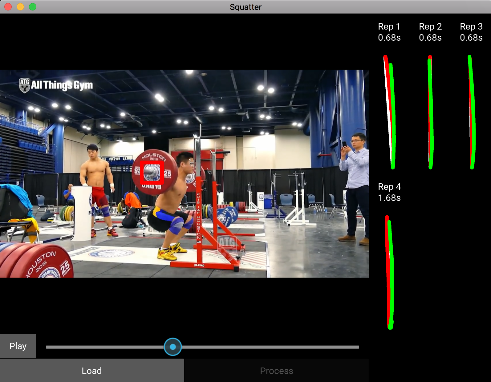
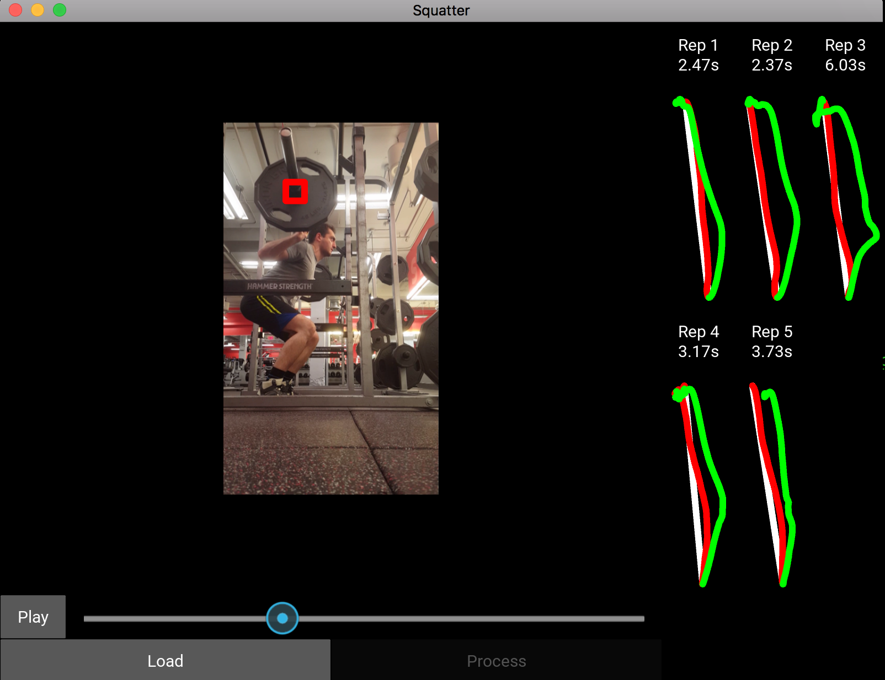

Squatter
========

Squatter is an app that can be used to analyze Squat & Deadlift performance
using computer vision and video processing technologies.

How to use
----------

* Record a video of Squat or Deadlift from the side. 
  * Slight angle is ok too as long as side of the barbell is visible.
  * Works best if the camera is stationary.
* Load a video using `Squatter` app to analyze.
* Seek to the first frame of the first repetition.
* Using mouse select a small circle covering the barbell collar, or just
  center of the plate from the side view.
* Click `Process` to start processing.

Once video is processed, its results are saved next to the video file with ".squatter"
extension. This way you don't have to analyze the same video again if you need to revisit it.

For each rep you should see: 
* Red line showing descent
* Green line showing ascent
* Rep speed in seconds (Only includes ascending part)

Screenshot of analysis of an expert Squat:


Screenshot of analysis of a novice Squat:



How to build
------------

Squatter has two main dependencies:
* OpenCV
* Kivy

With OpenCV very latest version is necessary (3.2.0 won't work), thus you will have to 
build it from source.
http://www.pyimagesearch.com/2016/12/19/install-opencv-3-on-macos-with-homebrew-the-easy-way

Squatter app itself can be built using PyInstaller:
```
$: pyinstaller --clean squatter.spec && cp Info.plist dist/squatter.app/Contents/Info.plist
```

